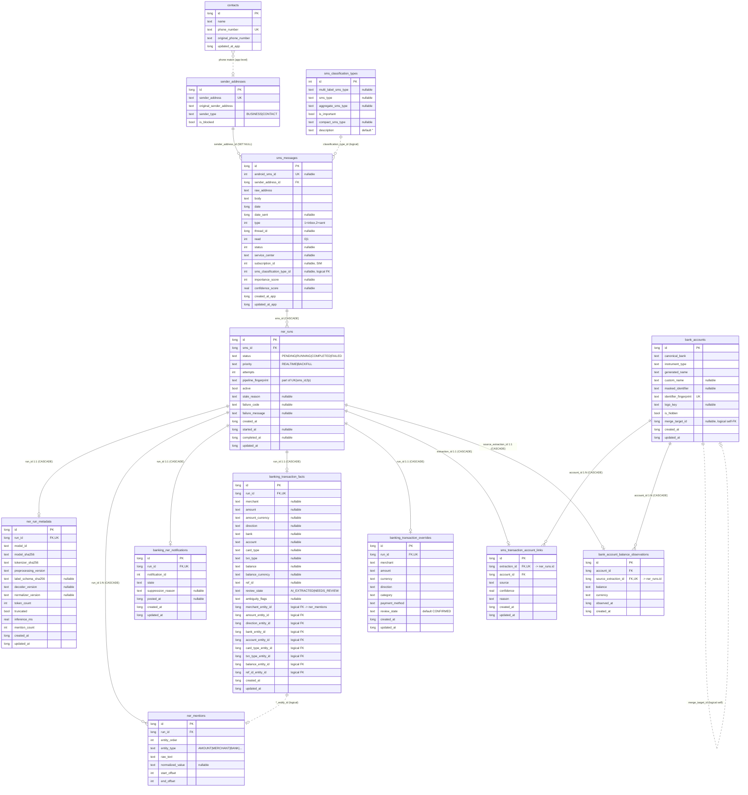

# Database Schema — `sms_database` (v6)

Room / SQLite database defined in `SmsDatabase.kt`. **13 tables**, **11 enforced foreign keys**, plus a few logical (non-enforced) associations.

| Item | Value |
|------|-------|
| Engine | SQLite via Android Room |
| File name | `sms_database` |
| Schema version | **6** (`exportSchema = true` → `core/schemas/.../SmsDatabase/6.json`) |
| DAOs | `SmsDao`, `ContactDao`, `NerDao` |
| Migrations | 1→2, 2→3, 3→4, 4→5, 5→6 |
| Seed data | 46 rows in `sms_classification_types` on first create |

---

## What changed in v6

v6 **splits the old fat `sms_ner_extractions` row** into a run + satellite tables, renames the NER tables to `ner_*` / `banking_*`, and adds a normalized transaction-facts table.

| v5 | v6 | Notes |
|----|----|-------|
| `sms_ner_extractions` | **`ner_runs`** | Lifecycle/queue only. IDs preserved. |
| `sms_ner_entities` | **`ner_mentions`** | `extraction_id` → `run_id`. IDs preserved. |
| `sms_transaction_overrides` | **`banking_transaction_overrides`** | `extraction_id` → `run_id`. |
| — | **`ner_run_metadata`** (new) | Model/token/inference fields moved off the run. |
| — | **`banking_ner_notifications`** (new) | Notification fields moved off the run. |
| — | **`banking_transaction_facts`** (new) | Normalized transaction view built from mentions. |

Retargeted FKs (same table names, now point at `ner_runs.id`):
- `sms_transaction_account_links.extraction_id`
- `bank_account_balance_observations.source_extraction_id`

Unchanged: `sms_messages`, `sender_addresses`, `contacts`, `sms_classification_types`, `bank_accounts`.

Key new capability: `ner_runs` is unique on **`(sms_id, pipeline_fingerprint)`** (was unique on `sms_id`), so an SMS can have **multiple runs**, one per pipeline version. New `active` / `stale_reason` columns track which run is current.

---

## Entity-Relationship Diagram

Solid lines = enforced Room `@ForeignKey` (label = child FK column + `ON DELETE`). Dotted lines = logical associations with no DB-level FK.



---

## Foreign keys (enforced)

All FKs use `ON UPDATE NO ACTION`.

| Child table | FK column | Parent | Parent col | ON DELETE | Cardinality |
|-------------|-----------|--------|-----------|-----------|-------------|
| `sms_messages` | `sender_address_id` | `sender_addresses` | `id` | **SET NULL** | N:1 |
| `ner_runs` | `sms_id` | `sms_messages` | `id` | **CASCADE** | N:1 |
| `ner_run_metadata` | `run_id` | `ner_runs` | `id` | **CASCADE** | 1:1 (unique) |
| `ner_mentions` | `run_id` | `ner_runs` | `id` | **CASCADE** | N:1 |
| `banking_ner_notifications` | `run_id` | `ner_runs` | `id` | **CASCADE** | 1:1 (unique) |
| `banking_transaction_facts` | `run_id` | `ner_runs` | `id` | **CASCADE** | 1:1 (unique) |
| `banking_transaction_overrides` | `run_id` | `ner_runs` | `id` | **CASCADE** | 1:1 (unique) |
| `sms_transaction_account_links` | `extraction_id` | `ner_runs` | `id` | **CASCADE** | 1:1 (unique) |
| `sms_transaction_account_links` | `account_id` | `bank_accounts` | `id` | **CASCADE** | N:1 |
| `bank_account_balance_observations` | `account_id` | `bank_accounts` | `id` | **CASCADE** | N:1 |
| `bank_account_balance_observations` | `source_extraction_id` | `ner_runs` | `id` | **CASCADE** | 1:1 (unique) |

**Cascade behavior:** deleting an `sms_messages` row cascades to all its `ner_runs`, and each run cascades to its metadata, mentions, notification, facts, overrides, account link, and balance observation. Deleting a `bank_accounts` row cascades to its links and balance observations.

---

## Logical relations (no Room `@ForeignKey`)

| From | Column(s) | To | Purpose |
|------|-----------|----|---------|
| `sms_messages` | `sms_classification_type_id` | `sms_classification_types.id` | ML classification label |
| `banking_transaction_facts` | `*_entity_id` (merchant/amount/direction/bank/account/card_type/txn_type/balance/ref_id) | `ner_mentions.id` | Provenance to the source mention |
| `contacts` | `phone_number` | `sender_addresses.sender_address` | App-level name matching (normalized) |
| `bank_accounts` | `merge_target_id` | `bank_accounts.id` | Points at merge survivor when deduping |

---

## Tables

### `sender_addresses` — *(unchanged)*
Normalized senders for matching and blocking.

| Column | Type | Constraints | Notes |
|--------|------|-------------|-------|
| `id` | INTEGER | PK, AUTOINCREMENT | |
| `sender_address` | TEXT | NOT NULL, **UNIQUE** | Normalized |
| `original_sender_address` | TEXT | NOT NULL | As received |
| `sender_type` | TEXT | NOT NULL | Enum `BUSINESS` / `CONTACT` |
| `is_blocked` | INTEGER (bool) | NOT NULL | Default false |

### `contacts` — *(unchanged)*
Device contacts cache.

| Column | Type | Constraints |
|--------|------|-------------|
| `id` | INTEGER | PK (not auto) |
| `name` | TEXT | NOT NULL |
| `phone_number` | TEXT | NOT NULL, **UNIQUE** |
| `original_phone_number` | TEXT | NOT NULL |
| `updated_at_app` | INTEGER | NOT NULL |

### `sms_messages` — *(unchanged)*
Imported SMS plus on-device ML fields.

| Column | Type | Constraints | Notes |
|--------|------|-------------|-------|
| `id` | INTEGER | PK, AUTOINCREMENT | |
| `android_sms_id` | INTEGER | nullable, **UNIQUE** | System SMS id |
| `sender_address_id` | INTEGER | NOT NULL, FK → `sender_addresses.id`, indexed | |
| `raw_address` | TEXT | NOT NULL | |
| `body` | TEXT | NOT NULL | |
| `date` | INTEGER | NOT NULL | |
| `date_sent` | INTEGER | nullable | |
| `type` | INTEGER | NOT NULL | 1 inbox, 2 sent |
| `thread_id` | INTEGER | nullable | |
| `read` | INTEGER | NOT NULL | 0/1 |
| `status` | INTEGER | nullable | -1/0/32/64 |
| `service_center` | TEXT | nullable | |
| `subscription_id` | INTEGER | nullable | SIM slot |
| `sms_classification_type_id` | INTEGER | nullable | Logical FK |
| `importance_score` | INTEGER | nullable | |
| `confidence_score` | REAL | nullable | |
| `created_at_app` / `updated_at_app` | INTEGER | NOT NULL | |

### `sms_classification_types` — *(unchanged)*
Lookup table, 46 seeded rows.

| Column | Type | Constraints |
|--------|------|-------------|
| `id` | INTEGER | PK |
| `multi_label_sms_type` | TEXT | nullable |
| `sms_type` | TEXT | nullable |
| `aggregate_sms_type` | TEXT | nullable |
| `is_important` | INTEGER (bool) | NOT NULL |
| `compact_sms_type` | TEXT | nullable |
| `description` | TEXT | NOT NULL, default `''` |

### `ner_runs` — *(new; replaces `sms_ner_extractions`)*
One NER job per (SMS, pipeline). Lifecycle + queue only.

| Column | Type | Constraints | Notes |
|--------|------|-------------|-------|
| `id` | INTEGER | PK, AUTOINCREMENT | |
| `sms_id` | INTEGER | NOT NULL, FK → `sms_messages.id` | |
| `status` | TEXT | NOT NULL | e.g. PENDING/RUNNING/COMPLETED/FAILED |
| `priority` | TEXT | NOT NULL | REALTIME / BACKFILL |
| `attempts` | INTEGER | NOT NULL | |
| `pipeline_fingerprint` | TEXT | NOT NULL | Identifies pipeline version; `'legacy'` for migrated rows |
| `active` | INTEGER (bool) | NOT NULL | Current run for the SMS |
| `stale_reason` | TEXT | nullable | Why a run was superseded |
| `failure_code` / `failure_message` | TEXT | nullable | |
| `created_at` / `updated_at` | INTEGER | NOT NULL | |
| `started_at` / `completed_at` | INTEGER | nullable | |

**Indexes:** unique `(sms_id, pipeline_fingerprint)`; `(status, priority, created_at)` (queue); `(active, status, completed_at)`.

### `ner_run_metadata` — *(new; 1:1 with `ner_runs`)*
Model/pipeline provenance and timing, split off the run.

| Column | Type | Constraints | Notes |
|--------|------|-------------|-------|
| `id` | INTEGER | PK, AUTOINCREMENT | |
| `run_id` | INTEGER | NOT NULL, FK, **UNIQUE** | |
| `model_id`, `model_sha256`, `tokenizer_sha256`, `preprocessing_version` | TEXT | NOT NULL | Migrated rows default `'legacy'` |
| `label_schema_sha256`, `decoder_version`, `normalizer_version` | TEXT | nullable | New provenance |
| `token_count` | INTEGER | NOT NULL | |
| `truncated` | INTEGER (bool) | NOT NULL | |
| `inference_ms` | REAL | NOT NULL | |
| `mention_count` | INTEGER | NOT NULL | Was `entity_count` |
| `created_at` / `updated_at` | INTEGER | NOT NULL | |

Only populated for runs with `status = 'COMPLETED'`.

### `ner_mentions` — *(renamed from `sms_ner_entities`)*
Extracted entities for a run.

| Column | Type | Constraints | Notes |
|--------|------|-------------|-------|
| `id` | INTEGER | PK, AUTOINCREMENT | |
| `run_id` | INTEGER | NOT NULL, FK → `ner_runs.id` | Was `extraction_id` |
| `entity_order` | INTEGER | NOT NULL | |
| `entity_type` | TEXT | NOT NULL | ACCOUNT, AMOUNT, BALANCE, BANK, CARD_TYPE, DATE, DIRECTION, LIMIT, MERCHANT, REF_ID, TXN_TYPE, UPI_ID |
| `raw_text` | TEXT | NOT NULL | |
| `normalized_value` | TEXT | nullable | |
| `start_offset` / `end_offset` | INTEGER | NOT NULL | Span in body |

**Indexes:** `run_id`; `(run_id, entity_type, entity_order)`.

### `banking_ner_notifications` — *(new; 1:1 with `ner_runs`)*
Notification state, split off the run.

| Column | Type | Constraints |
|--------|------|-------------|
| `id` | INTEGER | PK, AUTOINCREMENT |
| `run_id` | INTEGER | NOT NULL, FK, **UNIQUE** |
| `notification_id` | INTEGER | NOT NULL |
| `state` | TEXT | NOT NULL (indexed) |
| `suppression_reason` | TEXT | nullable |
| `posted_at` | INTEGER | nullable |
| `created_at` / `updated_at` | INTEGER | NOT NULL |

Migrated only from rows where old `notification_state != 'NONE'`.

### `banking_transaction_facts` — *(new; 1:1 with `ner_runs`)*
Normalized, queryable transaction view derived from mentions.

| Column | Type | Constraints | Notes |
|--------|------|-------------|-------|
| `id` | INTEGER | PK, AUTOINCREMENT | |
| `run_id` | INTEGER | NOT NULL, FK, **UNIQUE** | |
| `merchant`, `amount`, `amount_currency`, `direction`, `bank`, `account`, `card_type`, `txn_type`, `balance`, `balance_currency`, `ref_id` | TEXT | nullable | Extracted values |
| `review_state` | TEXT | NOT NULL | `AI_EXTRACTED` / `NEEDS_REVIEW` (indexed) |
| `ambiguity_flags` | TEXT | nullable | e.g. TRUNCATED, MISSING_AMOUNT |
| `*_entity_id` (merchant/amount/direction/bank/account/card_type/txn_type/balance/ref_id) | INTEGER | nullable | Logical → `ner_mentions.id` |
| `created_at` / `updated_at` | INTEGER | NOT NULL | |

Backfilled at migration from completed runs; currency inferred from raw text, `review_state` derived from truncation / missing amount / unsupported direction.

### `banking_transaction_overrides` — *(renamed from `sms_transaction_overrides`)*
User corrections to a transaction.

| Column | Type | Constraints |
|--------|------|-------------|
| `id` | INTEGER | PK, AUTOINCREMENT |
| `run_id` | INTEGER | NOT NULL, FK, **UNIQUE** (was `extraction_id`) |
| `merchant`, `amount`, `currency`, `direction`, `category`, `payment_method` | TEXT | NOT NULL |
| `review_state` | TEXT | NOT NULL (entity default `CONFIRMED`) |
| `created_at` / `updated_at` | INTEGER | NOT NULL |

### `bank_accounts` — *(unchanged)*
Discovered bank instruments.

| Column | Type | Constraints | Notes |
|--------|------|-------------|-------|
| `id` | INTEGER | PK, AUTOINCREMENT | |
| `canonical_bank`, `instrument_type`, `generated_name` | TEXT | NOT NULL | |
| `custom_name`, `masked_identifier`, `logo_key` | TEXT | nullable | |
| `identifier_fingerprint` | TEXT | NOT NULL, **UNIQUE** | Dedup key |
| `is_hidden` | INTEGER (bool) | NOT NULL | |
| `merge_target_id` | INTEGER | nullable | Logical self-FK |
| `created_at` / `updated_at` | INTEGER | NOT NULL | |

**Index:** `(canonical_bank, instrument_type)`.

### `sms_transaction_account_links` — *(FK retargeted to `ner_runs`)*
Links a run to a bank account. Column still named `extraction_id`.

| Column | Type | Constraints |
|--------|------|-------------|
| `id` | INTEGER | PK, AUTOINCREMENT |
| `extraction_id` | INTEGER | NOT NULL, FK → `ner_runs.id`, **UNIQUE** |
| `account_id` | INTEGER | NOT NULL, FK → `bank_accounts.id`, indexed |
| `source`, `reason` | TEXT | NOT NULL |
| `confidence` | REAL | NOT NULL |
| `created_at` / `updated_at` | INTEGER | NOT NULL |

### `bank_account_balance_observations` — *(FK retargeted to `ner_runs`)*
Balance snapshot from a run. Column still named `source_extraction_id`.

| Column | Type | Constraints |
|--------|------|-------------|
| `id` | INTEGER | PK, AUTOINCREMENT |
| `account_id` | INTEGER | NOT NULL, FK → `bank_accounts.id` |
| `source_extraction_id` | INTEGER | NOT NULL, FK → `ner_runs.id`, **UNIQUE** |
| `balance`, `currency` | TEXT | NOT NULL |
| `observed_at` / `created_at` | INTEGER | NOT NULL |

**Index:** `(account_id, observed_at)`.

---

## Unique indexes

| Table | Column(s) | Purpose |
|-------|-----------|---------|
| `sender_addresses` | `sender_address` | Dedup senders |
| `contacts` | `phone_number` | Dedup contacts |
| `sms_messages` | `android_sms_id` | Prevent re-import |
| `ner_runs` | `(sms_id, pipeline_fingerprint)` | One run per SMS per pipeline |
| `ner_run_metadata` | `run_id` | One metadata row per run |
| `banking_ner_notifications` | `run_id` | One notification per run |
| `banking_transaction_facts` | `run_id` | One fact row per run |
| `banking_transaction_overrides` | `run_id` | One override per run |
| `sms_transaction_account_links` | `extraction_id` | One account link per run |
| `bank_accounts` | `identifier_fingerprint` | Dedup accounts |
| `bank_account_balance_observations` | `source_extraction_id` | One observation per run |

---

## Migration 5 → 6 (summary)

Runs with `PRAGMA foreign_keys=OFF` while rebuilding:

1. Create `ner_runs`; copy from `sms_ner_extractions` (IDs preserved, `pipeline_fingerprint='legacy'`, `active=1`).
2. Create `ner_run_metadata`; backfill model/timing fields from completed extractions.
3. Create `ner_mentions`; copy from `sms_ner_entities` (`extraction_id` → `run_id`, IDs preserved).
4. Create `banking_ner_notifications`; backfill from extractions with a non-`NONE` notification state.
5. Create `banking_transaction_facts`; compute from completed runs + mentions (currency/review-state heuristics).
6. Create `banking_transaction_overrides`; copy from `sms_transaction_overrides`.
7. Rebuild `sms_transaction_account_links` and `bank_account_balance_observations` so their FKs point at `ner_runs`; copy data via legacy temp tables.
8. Drop `sms_transaction_overrides`, `sms_ner_entities`, `sms_ner_extractions`; re-enable foreign keys.

---

## Data flow (v6)

```
SMS arrives on device
  └─ sender_addresses (normalized identity)
       └─ sms_messages (+ ML classification, importance, confidence)
            └─ ner_runs (per-pipeline job: status, priority, attempts, active)
                 ├─ ner_run_metadata        (model + timing provenance)
                 ├─ ner_mentions            (AMOUNT, MERCHANT, ACCOUNT, ...)
                 ├─ banking_ner_notifications (notification state)
                 ├─ banking_transaction_facts (normalized txn; *_entity_id → mentions)
                 ├─ banking_transaction_overrides (user corrections)
                 ├─ sms_transaction_account_links ─→ bank_accounts
                 └─ bank_account_balance_observations ─→ bank_accounts
```

`contacts` sits beside this graph, used to resolve display names against normalized numbers (not via a DB FK).
