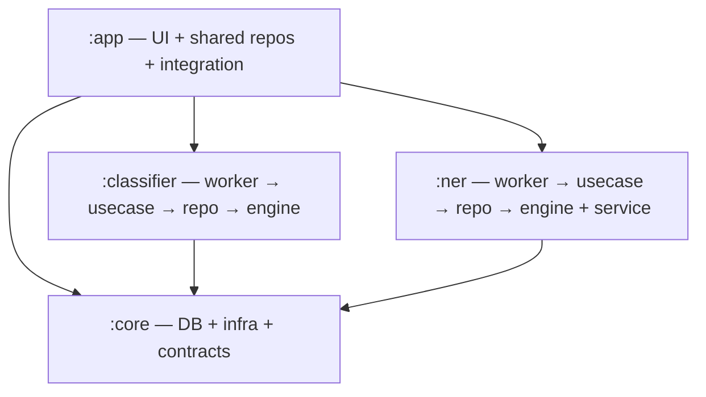

# MsgSense — Architecture & Modularization Plan

**Single source of truth** for the module split and the NER pipeline's current state.

Goal: split into four modules following a **vertical-slice feature-module** design.
`:core` is **pure infrastructure**; each ML feature (`:classifier`, `:ner`) is a
**self-contained vertical slice** that owns its full stack (worker → use case →
feature-specific repository → `:core` DAOs); and `:app` owns the UI, the **shared
messaging** repositories/use-cases, Android integration, and DI wiring.

- **`:app`** — UI (by feature package: `inbox/`, `search/`, `banking/`, `contacts/`,
  `onboarding/`, …) + the **shared messaging** repositories (`SmsRepository`,
  `ContactRepository`, `OnboardingRepository`) + the **generic messaging domain/use-cases**
  (send/search/mark/delete/block/contacts/onboarding) + Android integration (SMS/contact
  **receivers**, contact **observer**, Hilt **entry points**, `SmsInserter`, `PrewarmManager`)
  + DI wiring.
- **`:core`** — pure foundation: **Room DB** (all DAOs/entities/`SmsDatabase`/migrations),
  `SmsContentProvider` + mappers, network, notifications, permissions, device, utils,
  base UI/databinding, shared domain **models**, and the cross-module **contract**
  (`NerScheduler`). No feature logic, no repositories, no use cases.
- **`:classifier`** — vertical slice for classification: **worker** (`SmsProcessingWorker`)
  → **use case** (`ClassifySmsUseCase`) → **feature repository** (`ClassifierRepository`),
  plus the engine (`SmsClassifierModel` + tokenizer + `SmsClassifier` API + `SmsBatchProcessor`).
  Depends on `:core` only.
- **`:ner`** — vertical slice for banking intelligence (extract → facts → accounts → read API):
  **workers** (coordinator/realtime/result-notification/account-organization) → **use cases** →
  **feature repository** (`NerExtractionRepository`, plus the `BankingTransactionFactBuilder` /
  `BankAccountOrganizer` write side), on top of the engine (MobileBERT runtime + Rust tokenizer),
  the process-isolated inference service, and `NerWorkScheduler`. Depends on `:core` only.

---

## 1. Target module graph (must stay acyclic)

**Why `:app` is on top:** `:app` depends on everything and nothing depends on it, so all
shared code must live *below* it. `:classifier` and `:ner` never depend on each other or on
`:app` — only on `:core`.

**Vertical slice per feature:** each feature module is a full stack — a WorkManager **worker**
(framework entry point) delegates to a **use case** (feature domain logic), which reads/writes
through a **feature-specific repository** that wraps `:core` DAOs. This is distinct from the
**shared messaging repositories** in `:app` (`SmsRepository`, …) that back the UI and generic
CRUD; feature modules keep their own data layer instead of reaching into `:app`.

**Why the DB stays in `:core`:** a Room `@Database` must reference every entity/DAO it owns
(`SmsDao`, `NerDao`, `ContactDao`, `SmsNer*`, `BankAccount*`, …), so it can't be split across
feature modules. `:app` repositories and the feature modules all read/write through `:core`
DAOs.

---

## 2. What lives where (redistribution)

### `:core` (pure infra — stays / shrinks to this)
- **DB:** `data/local/{dao,entities,db,model,preference}`, `SmsDatabase`, migrations, schemas, `DatabaseModule`.
- **SMS data source:** `ISmsContentProvider`/`SmsContentProvider`, `SmsMapper`, `SmsInfoModel`, SMS constants/util, `SmsSender` (telephony wrapper).
- **Infra:** `notification/*`, `permission/*`, `device/*` (`DeviceTierEvaluator`), `util/*`, network/Retrofit, base UI + `DataBindingAdapters`.
- **Shared domain models** used by more than one module (e.g. `SmsBatchResult`, `FetchResult`, `SearchSection*`, `SmsImportanceType`).
- **Shared reference data:** `BankRegistry` (+ `BalanceRefreshMethod`) — inert bank metadata with no behaviour, read by `:ner` (`BankAccountOrganizer.resolve`/`resolveSender`) *and* `:app` UI (`AccountDetailFrag` balance-refresh action). Keeps the buildSrc `verifyBankRegistry` source path stable.
- **Contracts:** `NerContracts` (`NerScheduler` + `NerConstants`).
- **Shared worker util:** `worker/WorkerExecution`.
- `SharedPreferencesManager` / `PreferenceKey`.

### `:app` (UI + shared messaging stack + integration — moved out of `:core`)
- All `ui/*`, `MainActivity`, `App`, app-level DI.
- **Shared messaging repositories:** `SmsRepository`, `ContactRepository`, `OnboardingRepository` + their interfaces (`ISmsRepository`, …) + `RepositoryModule`. *(Feature-specific repositories live in their feature modules.)*
- **Generic messaging domain/use-cases:** the `domain/usecase/*` layer (send/search/mark/delete/block/contacts/onboarding). *(Feature-specific use cases like `ClassifySmsUseCase` live in their feature modules.)*
- **Android integration:** `ReadSmsBroadCastReceiver`, `DeliveredSmsReceiver`, `SentSmsReceiver`, `ContactObserver`, and their Hilt **entry points**; `SmsInserter` (incoming-SMS classify+insert); `PrewarmManager`.

### `:classifier` (`com.summer.classifier`) — vertical slice
- **Worker:** `SmsProcessingWorker`.
- **Use case:** `ClassifySmsUseCase`.
- **Feature repository:** `ClassifierRepository` — the slice's data layer over `:core` DAOs / `SmsContentProvider` (device read + classified-write). Absorbs the direct DAO/content-provider access `SmsBatchProcessor` uses today.
- **Engine:** `ml/model/SmsClassifierModel` (+ `SmsClassifierOutputModel`), `ml/tokenizer/*`, `ml/util/Constants`, `SmsBatchProcessor`, and the **`SmsClassifier` interface** (public API — relocated here from `:core`).
- DI: `ModelModule` (+ batch-processor provider), `SmsClassificationException`.
- Assets (`.onnx` + vocab); `onnxruntime` (dropped from `:core`).

### `:ner` (`com.summer.ner`) — vertical slice
Scope is the **whole banking-intelligence slice** — extract → facts → accounts → read API —
with MobileBERT as its engine, not just the model.

- **Workers:** `NerCoordinatorWorker` (backfill/realtime), result-notification worker,
  `BankAccountOrganizationWorker` + `BankAccountOrganizationScheduler` (moved from `app/banking/`).
- **Use cases:** NER coordination/extraction domain logic; `NerWorkScheduler` (binds the `:core` `NerScheduler` contract).
- **Feature repository:** `NerExtractionRepository` — reads (banking UI) + extraction/bank-account writes over `:core` NER DAOs; `:app` banking UI depends on `:ner` and reads through it.
- **Fact + account write side:** `BankingTransactionFactBuilder` (mentions → `banking_transaction_facts`) and `BankAccountOrganizer` (facts → `bank_accounts` / links / balance observations), moved from `core/banking/`. Pure Kotlin over Room — no ML — but it is the write-half of this slice's data layer and the coordinator calls `organizePending()` inline after `dao.complete(...)`.
- **Engine + service:** `NerInferenceService`, `NerIpc`, runtime, models, normalizer, preprocessor, `NerServiceClient`; `banking_ner/*` + `rust_tokenizer/` + `jniLibs/`; banking presentation models.
- NER assets (MobileBERT `.onnx` + `tokenizer.json`); manifest `NerInferenceService` (`process=":ner"`); `onnxruntime`.
- **Not here:** `BankRegistry` stays in `:core` (see below) and all banking **UI** stays in `:app`.

---

## 3. Inter-module communication

- **`:app` → features:** direct. `:app` depends on `:classifier` and `:ner`, so it calls their
  APIs / enqueues their workers directly (e.g. incoming-SMS receiver → classifier; banking UI → NER read).
- **`:classifier` → `:ner`:** through the **`NerScheduler` interface in `:core`**. The classifier
  orchestration calls `nerScheduler.enqueueBackfill()`; `:ner`'s `NerWorkScheduler` implements it;
  Hilt binds the impl at the `:app` level. No `:classifier → :ner` edge.
- **Features → DB:** each feature reads/writes through its **own feature repository** over
  `:core` DAOs; `:app`'s shared repositories wrap the same DAOs for UI and generic CRUD.
- No feature module depends on another; no module depends on `:app`.

> **Open point (see §6.4):** interface-via-`:core` for the classifier→NER hop is the approach
> *for now*; we may revisit a better mechanism later.

---

## 4. Current NER pipeline behavior (as-is)

What the code does **today** (post removal of the app-startup trigger).

### Triggers (external entry points)
- **Classification success** — classifier orchestration → `nerScheduler.enqueueBackfill()`.
- **Banking screen entry** — `BankingHomeViewModel` / `TransactionListViewModel` → `enqueueBackfill()`.
- **Incoming banking SMS (realtime)** — `ReadSmsBroadCastReceiver` → `enqueueRealtime(sms)`.
- ~~App startup~~ — **removed**.

External `enqueueBackfill()` uses WorkManager `KEEP` (dedups into an in-progress drain);
self-continuation uses `APPEND_OR_REPLACE` (baton pass).

### Realtime path — *kept as-is*
- SHORT_SERVICE foreground service, one item per run, `REALTIME_TIMEOUT_MS` = 2 min.
- **Model lifecycle: load → compute → unload per request.**

### Backfill path
- Single **drain-to-empty loop** bounded only by `BACKFILL_MAX_RUN_MS` = 5 min (chunk size removed).
- **One warm binding for the whole run:** model stays loaded up to ~5 min, then unloads
  (`client.close()`) before the next backfill worker.
- Preempts for realtime work; on remaining `PENDING`, hands off to a fresh worker via a chain baton.
- DATA_SYNC foreground service.

---

## 5. Progress

- **Phase 1 — DONE (contracts & core inversion, still one module).** Added the `SmsClassifier`
  interface; pointed `SmsInserter` + `SmsBatchProcessor` at it; extracted `ClassifySmsUseCase`;
  removed `fetchSmsMessagesFromDevice`/`setSmsProcessingStatusCompleted` from
  `ISmsRepository`/`SmsRepository`; deleted the dead `SmsProcessingService`. Builds green.
  - Under this target, two of those land in `:classifier` when the module is created: the
    `SmsClassifier` interface (currently in `:core.classifier`) and `ClassifySmsUseCase`. The
    inversion itself is unchanged — only their final home moves.

---

## 6. Open points (deferred decisions)

1. **Hybrid drain strategy.** Keep the single drain-to-empty loop for now; later, drain-to-empty
   in the **foreground** + WorkManager-chunked in the **background**.
2. **Cron / periodic backup trigger.** Decide whether we want a periodic sweep as a safety net
   (currently none).
3. **NER model eviction (backfill).** Consider a **~120s idle warm-hold** so consecutive backfill
   runs reuse the loaded model (realtime stays load → compute → unload).
4. **`:classifier` → `:ner` communication.** Interface-via-`:core` for now; revisit later.
5. **`SmsInserter` home.** Lands in `:app` (incoming orchestration); it uses `ISmsRepository.insertSms`
   today. If we'd rather it sit in `:classifier`, repoint it at the `ClassifierRepository` /
   `SmsContentProvider` / `SmsDao` directly.
6. **Bank-account organizing — RESOLVED: `:ner`.** `BankAccountOrganizer`,
   `BankingTransactionFactBuilder`, the organization worker/scheduler and `NerExtractionRepository`
   all live in `:ner`. It is not ML code, but it is the write-half of the slice's data layer: its only
   input is `NerDao.accountOrganizingCandidates` (completed `ner_runs` ⨝ `banking_transaction_facts`),
   `NerCoordinatorWorker` calls `organizePending()` inline on both the realtime and backfill paths, and
   `NerExtractionRepository` already injects the organizer. Putting it in `:app` would create a
   `:ner → :app` cycle; putting it in a peer `:banking` module would need a second cross-module
   contract. `BankRegistry` is the exception and stays in `:core` as shared reference data.

---

## 7. Phased execution (each phase compiles & is independently valuable)

- **Phase 1 — DONE.** Classifier contract inversion + `ClassifySmsUseCase` + repo slimming.
- **Phase 2 — Create `:ner`.** Move `ner/*` + `banking_ner/*` + Rust/JNI + assets + inference-service
  manifest into `:ner`, along with the slice's data layer: `NerExtractionRepository`, banking models,
  and the organizing code that is split across modules today — `core/banking/{BankAccountOrganizer,
  BankingTransactionFactBuilder}` plus `app/banking/{BankAccountOrganizationWorker,
  BankAccountOrganizationScheduler}`. Leave `BankRegistry` in `:core`. Keep `NerScheduler` in `:core`;
  wire `:app → :ner`. Lower risk (NER is already isolated behind `NerScheduler`).
- **Phase 3 — Create `:classifier`.** Move ML + tokenizer + `SmsClassifier` interface +
  `SmsBatchProcessor` + `ClassifySmsUseCase` + `SmsProcessingWorker` + assets into `:classifier`, and
  introduce `ClassifierRepository` as the slice's data layer over `:core` DAOs; wire `:app → :classifier`.
- **Phase 4 — Move shared messaging stack + integration to `:app`.** Relocate the generic
  `domain/usecase/*` layer, the **shared** repositories (`SmsRepository`/`ContactRepository`/
  `OnboardingRepository` + interfaces + `RepositoryModule`), SMS/contact **receivers**, the contact
  **observer**, their Hilt **entry points**, `SmsInserter`, and `PrewarmManager` from `:core` into
  `:app` feature packages. (Domain layer + Android integration move together to avoid a `:core → :app`
  cycle; feature-specific repos already left in Phases 2–3.)
- **Phase 5 — Slim `:core`.** Confirm `:core` = DB + infra + contracts only; drop unused deps
  (`onnxruntime`, ML/NER libs); per-module build checks + tests.

### Validation
`./gradlew :core:assembleDebug :classifier:assembleDebug :ner:assembleDebug :app:assembleDebug`;
run unit tests; manually verify onboarding classification + NER backfill end-to-end, the
incoming-SMS realtime path (receiver → classify → notify → NER), and that the `:ner` process spawns.
