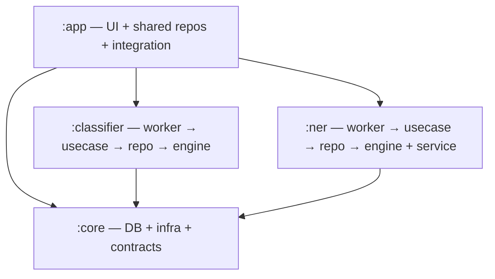

# MsgSense — Architecture & Modularization Plan

**Single source of truth** for the module split and the NER pipeline's current state.

Goal: split into four modules following a **vertical-slice feature-module** design.
`:core` is **pure infrastructure**; each ML feature (`:classifier`, `:ner`) is a
**self-contained vertical slice** that owns its full stack (worker → use case →
feature-specific repository → `:core` DAOs); and `:app` owns the UI, the **shared
messaging** repositories/use-cases, Android integration, and DI wiring.

- **`:app`** — UI (by feature package: `inbox/`, `search/`, `banking/`, `contacts/`,
  `onboarding/`, …) + the **shared messaging** repositories (`SmsRepository`,
  `ContactRepository`, `OnboardingRepository`) + the **generic messaging domain/use-cases**
  (send/search/mark/delete/block/contacts/onboarding) + Android integration (SMS/contact
  **receivers**, contact **observer**, Hilt **entry points**, `SmsInserter`, `PrewarmManager`)
  + DI wiring.
- **`:core`** — pure foundation: **Room DB** (all DAOs/entities/`SmsDatabase`/migrations),
  `SmsContentProvider` + mappers, network, notifications, permissions, device, utils,
  base UI/databinding, shared domain **models**, and the cross-module **contract**
  (`NerScheduler`). No feature logic, no repositories, no use cases.
- **`:classifier`** — vertical slice for classification: **worker** (`SmsProcessingWorker`)
  → **use case** (`ClassifySmsUseCase`) → **feature repository** (`ClassifierRepository`),
  plus the engine (`SmsClassifierModel` + tokenizer + `SmsBatchProcessor`) and the `SmsClassifier`
  contract its callers depend on. Depends on `:core` only.
- **`:ner`** — vertical slice for banking intelligence (extract → facts → accounts → read API):
  **workers** (coordinator/realtime/result-notification/account-organization) → **use cases** →
  **feature repository** (`BankingRepository`, plus the `BankAccountOrganizer` write side),
  on top of the engine (MobileBERT runtime + Rust tokenizer),
  the process-isolated inference service, and `NerWorkScheduler`. Depends on `:core` only.

---

## 1. Target module graph (must stay acyclic)

**Why `:app` is on top:** `:app` depends on everything and nothing depends on it, so all
shared code must live *below* it. `:classifier` and `:ner` never depend on each other or on
`:app` — only on `:core`.

**Vertical slice per feature:** each feature module is a full stack — a WorkManager **worker**
(framework entry point) delegates to a **use case** (feature domain logic), which reads/writes
through a **feature-specific repository** that wraps `:core` DAOs. This is distinct from the
**shared messaging repositories** in `:app` (`SmsRepository`, …) that back the UI and generic
CRUD; feature modules keep their own data layer instead of reaching into `:app`.

**Why the DB stays in `:core`:** a Room `@Database` must reference every entity/DAO it owns
(`SmsDao`, `NerDao`, `ContactDao`, `SmsNer*`, `BankAccount*`, …), so it can't be split across
feature modules. `:app` repositories and the feature modules all read/write through `:core`
DAOs.

---

## 2. What lives where (redistribution)

### `:core` (pure infra — stays / shrinks to this)
- **DB:** `data/local/{dao,entities,db,model,preference}`, `SmsDatabase`, migrations, schemas, `DatabaseModule`.
- **SMS data source:** `ISmsContentProvider`/`SmsContentProvider`, `SmsMapper`, `SmsInfoModel`, SMS constants/util, `SmsSender` (telephony wrapper).
- **Infra:** `notification/*`, `permission/*`, `device/*` (`DeviceTierEvaluator`), `util/*`, base UI + `DataBindingAdapters`.
- **Shared domain models** used by more than one module (e.g. `SmsBatchResult`, `FetchResult`, `SearchSection*`, `SmsImportanceType`).
- **Shared reference data:** `BankRegistry` (+ `BalanceRefreshMethod`) — inert bank metadata with no behaviour, read by `:ner` (`BankAccountOrganizer.resolve`/`resolveSender`) *and* `:app` UI (`AccountDetailFrag` balance-refresh action). Keeps the buildSrc `verifyBankRegistry` source path stable.
- **`BankingTransactionFactBuilder`** — called from inside `NerDao.complete()`'s transaction, so it stays with the DAO (§6.7).
- **Contracts:** `NerContracts` (`NerScheduler` + `NerConstants`). *(The classifier seam no longer needs to sit here — see `:classifier` below.)*
- **Shared worker util:** `worker/WorkerExecution`.
- `SharedPreferencesManager` / `PreferenceKey`.

### `:app` (UI + shared messaging stack + integration — moved out of `:core`)
- All `ui/*`, `MainActivity`, `App`, app-level DI.
- **Shared messaging repositories:** `SmsRepository`, `ContactRepository`, `OnboardingRepository` + their interfaces (`ISmsRepository`, …) + `RepositoryModule`. *(Feature-specific repositories live in their feature modules.)*
- **Generic messaging domain/use-cases:** the `domain/usecase/*` layer (send/search/mark/delete/block/contacts/onboarding). *(Feature-specific use cases like `ClassifySmsUseCase` live in their feature modules.)*
- **Android integration:** `ReadSmsBroadCastReceiver`, `DeliveredSmsReceiver`, `SentSmsReceiver`, `ContactObserver`, and their Hilt **entry points**; `SmsInserter` (incoming-SMS classify+insert); `PrewarmManager`.

### `:classifier` (`com.summer.classifier`) — vertical slice
- **Worker:** `SmsProcessingWorker`.
- **Use case:** `ClassifySmsUseCase`.
- **Feature repository:** `ClassifierRepository` — the slice's data layer over `:core` DAOs / `SmsContentProvider` (device read + classified-write). Absorbs the direct DAO/content-provider access `SmsBatchProcessor` uses today.
- **Engine:** `ml/model/SmsClassifierModel` (+ `SmsClassifierOutputModel`), `ml/tokenizer/*`, `ml/util/Constants`, `SmsBatchProcessor`.
- **Contract:** `ClassifierContracts` (`SmsClassifier` + `SmsClassification`) — the seam `SmsInserter` in `:app` and `SmsBatchProcessor` classify through. It sat in `:core` for Phases 1–3 only because `SmsInserter` did; once that moved to `:app` in Phase 4 the interface joined its implementation here. (Contrast `NerScheduler`, which must stay in `:core` because `:classifier` triggers NER without depending on `:ner`.)
- DI: `di/ModelModule` (binds `SmsClassifier` to the ONNX model); `SmsClassificationException`.
- Assets (`.onnx` + vocab); `onnxruntime` (dropped from `:core`).

### `:ner` (`com.summer.ner`) — vertical slice
Scope is the **whole banking-intelligence slice** — extract → facts → accounts → read API —
with MobileBERT as its engine, not just the model.

- **Workers:** `NerCoordinatorWorker` (backfill/realtime), result-notification worker,
  `BankAccountOrganizationWorker` + `BankAccountOrganizationScheduler` (moved from `app/banking/`).
- **Use cases:** NER coordination/extraction domain logic; `NerWorkScheduler` (binds the `:core` `NerScheduler` contract).
- **Feature repository:** `BankingRepository` — reads (banking UI) + extraction/bank-account writes over `:core` NER DAOs; `:app` banking UI depends on `:ner` and reads through it.
- **Account write side:** `BankAccountOrganizer` (facts → `bank_accounts` / links / balance observations), moved from `core/banking/`. Pure Kotlin over Room — no ML — but it is the write-half of this slice's data layer and the coordinator calls `organizePending()` inline after `dao.complete(...)`. `BankingTransactionFactBuilder` (mentions → `banking_transaction_facts`) stayed in `:core`; see §6.7.
- **Engine + service:** `NerInferenceService`, `NerIpc`, runtime, models, normalizer, preprocessor, `NerServiceClient`; `banking_ner/*` + `rust_tokenizer/` + `jniLibs/`; banking presentation models.
- NER assets (MobileBERT `.onnx` + `tokenizer.json`); manifest `NerInferenceService` (`process=":ner"`); `onnxruntime`.
- **Not here:** `BankRegistry` stays in `:core` (see below) and all banking **UI** stays in `:app`.

---

## 3. Inter-module communication

- **`:app` → features:** direct. `:app` depends on `:classifier` and `:ner`, so it calls their
  APIs / enqueues their workers directly (e.g. incoming-SMS receiver → classifier; banking UI → NER read).
- **`:classifier` → `:ner`:** through the **`NerScheduler` interface in `:core`**. The classifier
  orchestration calls `nerScheduler.enqueueBackfill()`; `:ner`'s `NerWorkScheduler` implements it;
  Hilt binds the impl at the `:app` level. No `:classifier → :ner` edge.
- **Features → DB:** each feature reads/writes through its **own feature repository** over
  `:core` DAOs; `:app`'s shared repositories wrap the same DAOs for UI and generic CRUD.
- No feature module depends on another; no module depends on `:app`.

> **Open point (see §6.4):** interface-via-`:core` for the classifier→NER hop is the approach
> *for now*; we may revisit a better mechanism later.

---

## 4. Current NER pipeline behavior (as-is)

What the code does **today** (post removal of the app-startup trigger).

### Triggers (external entry points)
- **Classification success** — classifier orchestration → `nerScheduler.enqueueBackfill()`.
- **Banking screen entry** — `BankingHomeViewModel` / `TransactionListViewModel` → `enqueueBackfill()`.
- **Incoming banking SMS (realtime)** — `ReadSmsBroadCastReceiver` → `enqueueRealtime(sms)`.
- ~~App startup~~ — **removed**.

External `enqueueBackfill()` uses WorkManager `KEEP` (dedups into an in-progress drain);
self-continuation uses `APPEND_OR_REPLACE` (baton pass).

### Realtime path — *kept as-is*
- SHORT_SERVICE foreground service, one item per run, `REALTIME_TIMEOUT_MS` = 2 min.
- **Model lifecycle: load → compute → unload per request.**

### Backfill path
- Single **drain-to-empty loop** bounded only by `BACKFILL_MAX_RUN_MS` = 5 min (chunk size removed).
- **One warm binding for the whole run:** model stays loaded up to ~5 min, then unloads
  (`client.close()`) before the next backfill worker.
- Preempts for realtime work; on remaining `PENDING`, hands off to a fresh worker via a chain baton.
- DATA_SYNC foreground service.

---

## 5. Progress

- **Phase 1 — DONE (contracts & core inversion, still one module).** Added the `SmsClassifier`
  interface; pointed `SmsInserter` + `SmsBatchProcessor` at it; extracted `ClassifySmsUseCase`;
  removed `fetchSmsMessagesFromDevice`/`setSmsProcessingStatusCompleted` from
  `ISmsRepository`/`SmsRepository`; deleted the dead `SmsProcessingService`. Builds green.
  - Both of those eventually landed in `:classifier`: `ClassifySmsUseCase` in Phase 3 and the
    `SmsClassifier` interface in Phase 4. The inversion itself never changed — only their home.
- **Phase 2 — DONE (`:ner` extracted).** Created the `:ner` library module (namespace
  `com.summer.ner`) holding the engine, the isolated-process inference service, the coordinator
  and result-notification workers, `NerWorkScheduler`, the bank-account organizer + its
  worker/scheduler, and `BankingRepository`. `:app` depends on `:ner` and no longer carries
  the ONNX runtime, the Rust tokenizer build, or the NER asset sync. Packages are now
  `com.summer.ner` (pipeline), `com.summer.ner.tokenizer` (JNI/decoder) and `com.summer.ner.banking`
  (organizing + read repo). `:app:assembleDebug` and all unit tests are green; the merged manifest
  still declares `NerInferenceService` with `android:process=":ner"`, and the APK packages both the
  rebuilt `libhf_tokenizer_jni.so` ABIs and the generated `ner_mobilebert` assets.
  - **Two deviations from §2.** `BankingTransactionFactBuilder` stayed in `:core` because
    `NerDao.complete()` calls it inside a `@Transaction`, on mentions that only get their IDs
    within that transaction — moving it would need `complete()` to take a builder lambda (see
    §6.7). `BankRegistry` stayed in `:core` as planned.
  - **JNI note.** The Rust exports are mangled from the Kotlin package
    (`Java_com_summer_ner_tokenizer_HfTokenizerBridge_*`), resolved at runtime rather than compile
    time. Any future rename of `com.summer.ner.tokenizer` must update `lib.rs` and regenerate the
    native library via `:ner:buildRustTokenizerAndroid`.

- **Phase 3 — DONE (`:classifier` extracted).** Created the `:classifier` library module
  (namespace `com.summer.classifier`) holding the ONNX model, WordPiece tokenizer, ML constants,
  `SmsBatchProcessor`, `ClassifySmsUseCase`, `SmsProcessingWorker`, `ModelModule` and the ML assets
  (`assets/ml/*`, still under the `ml/` prefix so the asset paths are unchanged). Added
  `ClassifierRepository` as the slice's data layer; `SmsBatchProcessor` now works in batches of
  `SmsEntity` and no longer touches `SmsDao`/`SmsContentProvider` directly. `:core` dropped
  `onnxruntime` and the unused `opennlp` dependency. `:app:assembleDebug` and all unit tests green.
  - **Deviation from §2.** The `SmsClassifier` contract stayed in `:core` (see the `:classifier`
    section above) — `SmsInserter` still classifies incoming SMS from inside `:core`. Once Phase 4
    moves `SmsInserter` to `:app`, the contract could follow the engine into `:classifier`.
  - **Dropped on the way.** `SmsBatchProcessor`'s `Flow<FetchResult>` overload had no callers and
    was removed rather than ported onto the repository.

- **Phase 4 — DONE (shared messaging stack moved to `:app`).** 44 files left `:core`: the 24-strong
  `domain/usecase` layer, the three shared repositories + their interfaces + `RepositoryModule`, the
  four SMS receivers, `ContactObserver`, all five Hilt `@EntryPoint`s, `SmsInserter` and
  `PrewarmManager`. They now sit under `com.summer.notifai.{domain.usecase, domain.repository,
  data.repository, sms, sms.receiver, contacts, di}`, and the app manifest's three receiver entries
  were repointed. `:core` no longer references `com.summer.notifai` at all;
  `:app:assembleDebug`, every module's androidTest compilation, and all unit tests are green.
  - **`BaseApp` had to give up its registrations.** It was the one piece of remaining-`:core` code
    reaching into the move set: it constructed `SentSmsReceiver` and resolved `ContactObserver`
    through `ContactObserverDepsEntryPoint`. Both dynamic registrations moved down into `:app`'s
    `App`, which already extends `BaseApp`; `BaseApp` keeps only notification channels, the
    main-process check and StrictMode. The manifest-declared receivers needed nothing but an FQCN
    update.
  - **Open point 5 resolved as planned.** `SmsInserter` landed in `:app` and still uses
    `ISmsRepository.insertSms`.
  - **Phase 3's deviation is now closed.** With `SmsInserter` out of `:core`, nothing in `:core`
    referenced the classification seam any more, so `ClassifierContracts.kt` (`SmsClassifier` +
    `SmsClassification`) followed the engine into `:classifier` as `com.summer.classifier`.
    Contract and implementation finally live in the same module.

- **Phase 5 — DONE (`:core` slimmed).** `:core` is now 88 Kotlin files of DB, data sources,
  notifications, permissions, device/utils, base UI, shared models and the `NerScheduler` contract.
  Every module builds on its own, all androidTest source sets compile, and all unit tests pass.
  - **Dependencies dropped as unused.** The entire networking stack — Retrofit, its serialization
    converter, OkHttp (BOM, core, logging interceptor), `kotlinx-serialization-json` and the Gson
    converter — had no callers anywhere in the repo; there is no networking code in any module.
    `:core`'s androidTest also dropped Espresso and `room-testing`, neither of which it used.
  - **`api` leaks fixed.** `:core` was exposing LiveData, `coroutines-android`, Crashlytics and
    `hilt-work` as `api` while not using them itself, so `:app`/`:classifier`/`:ner` were compiling
    against them without declaring them. Each consumer now declares what it actually uses. What
    stays `api` on `:core` is what genuinely appears in its public surface: the base UI stack
    (`core-ktx`, `appcompat`, `material`, databinding), `coroutines-core` and `paging-runtime` (DAOs
    hand back `Flow` and `PagingSource`), and `work-runtime` (`WorkerExecution` and
    `SmsProcessingError` expose `WorkInfo`). Room stays `implementation` — no production code
    outside `:core` touches it, only the `:app`/`:ner` instrumentation tests, which now declare
    `room-runtime` themselves.
  - **Dead code removed.** `DummyWorker` (a stub that only logged), `ServiceUtils`, `LauncherUtils`
    and `SmsInsertionFailedException` had zero references anywhere; all four were orphans from
    early-2025 work. Deleting `DummyWorker` is what let `hilt-work` leave `:core` entirely.

---

## 6. Open points (deferred decisions)

1. **Hybrid drain strategy.** Keep the single drain-to-empty loop for now; later, drain-to-empty
   in the **foreground** + WorkManager-chunked in the **background**.
2. **Cron / periodic backup trigger.** Decide whether we want a periodic sweep as a safety net
   (currently none).
3. **NER model eviction (backfill).** Consider a **~120s idle warm-hold** so consecutive backfill
   runs reuse the loaded model (realtime stays load → compute → unload).
4. **`:classifier` → `:ner` communication.** Interface-via-`:core` for now; revisit later.
5. **`SmsInserter` home — RESOLVED: `:app`.** Moved in Phase 4 and still uses
   `ISmsRepository.insertSms`. If we'd rather it sit in `:classifier`, repoint it at the
   `ClassifierRepository` / `SmsContentProvider` / `SmsDao` directly.
6. **Bank-account organizing — RESOLVED: `:ner`.** `BankAccountOrganizer`,
   `BankingTransactionFactBuilder`, the organization worker/scheduler and `BankingRepository`
   all live in `:ner`. It is not ML code, but it is the write-half of the slice's data layer: its only
   input is `NerDao.accountOrganizingCandidates` (completed `ner_runs` ⨝ `banking_transaction_facts`),
   `NerCoordinatorWorker` calls `organizePending()` inline on both the realtime and backfill paths, and
   `BankingRepository` already injects the organizer. Putting it in `:app` would create a
   `:ner → :app` cycle; putting it in a peer `:banking` module would need a second cross-module
   contract. `BankRegistry` is the exception and stays in `:core` as shared reference data.
7. **`BankingTransactionFactBuilder` home.** Left in `:core` next to `NerDao`, which calls it from
   inside the `complete()` transaction. To finish moving banking rules out of `:core`, `complete()`
   would need to accept a fact-builder lambda so `:ner` supplies the mapping. Deferred.
8. **`ChatSessionTracker` home.** Sits in `:core/di` and holds which chat the user currently has
   open, so notifications can be suppressed. `AppNotificationManager` (`:core`) reads it and
   `SmsInboxFrag` (`:app`) writes it — genuinely shared session state, but more app state than
   infrastructure. Left alone in Phase 5.
9. **Per-feature repackaging in `:app`.** The stack moved in Phase 4 kept its old `:core` layer
   layout (`domain/usecase`, `domain/repository`, `data/repository`). Re-cutting it into `inbox/`,
   `search/`, `contacts/`, `onboarding/` packages is cosmetic and crosses no module boundary.
10. **Unreferenced members inside live files.** Phase 5 deleted whole dead files only.
    `UiUtils.getScreenHeightIntDp` / `Int.pxToDp` / `Int.dp` and the leftover `main()` in
    `ArithmeticUtils.kt` also have no callers, but sit alongside used code.

---

## 7. Phased execution (each phase compiles & is independently valuable)

- **Phase 1 — DONE.** Classifier contract inversion + `ClassifySmsUseCase` + repo slimming.
- **Phase 2 — DONE.** `:ner` created; see §5 for what landed and the two deviations.
- **Phase 3 — DONE.** `:classifier` created; see §5 for what landed and the contract deviation.
- **Phase 4 — DONE.** Shared messaging stack moved to `:app`; see §5 for what landed, the `BaseApp`
  change and the classifier contract that came with it. The moved code mirrors its old `:core` layer
  layout rather than being re-cut into per-feature packages — regrouping `domain/usecase` into
  `inbox/`, `search/`, `contacts/`, `onboarding/` is a follow-up pass that touches no module
  boundaries.
- **Phase 5 — DONE.** `:core` slimmed; see §5 for the dependencies dropped, the `api` leaks pushed
  down to the consumers, and the dead code removed. **The split is complete.**

### Validation
`./gradlew :core:assembleDebug :classifier:assembleDebug :ner:assembleDebug :app:assembleDebug`;
run unit tests; manually verify onboarding classification + NER backfill end-to-end, the
incoming-SMS realtime path (receiver → classify → notify → NER), and that the `:ner` process spawns.
