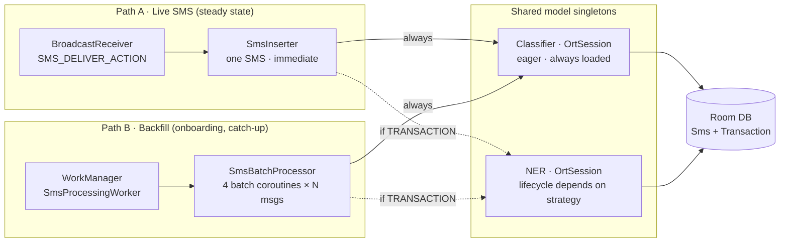

# Decision 2 · Model loading strategy

When does each `OrtSession` come alive, and when does it go away?

Both models are ONNX Runtime, so they share **one process-wide
`OrtEnvironment`** (via `OrtEnvironment.getEnvironment()`, a static
singleton). Only the two `OrtSession` instances have different lifecycles.

## Two ingestion paths, one set of models

Before evaluating strategies: the app has two entry points that need
inference. Both call the same singleton model instances.



- **Path A** is stateless per message.
- **Path B** is a batched foreground worker.

The strategies below choose *when the NER singleton is alive*.

## Approaches considered

### 2.1 · Eager both at startup

Both `OrtSession` instances are created on Application `onCreate` (or on
first Hilt injection at app cold-start) and held forever.

**Pros**

- Zero latency on first inference — everything is warm.
- Simple lifecycle: load once, use forever.

**Cons**

- Cold-start grows by ~500–1500 ms (NER session creation).
- ~310 MiB of native memory held even for users who never see a
  transaction. On 3–4 GB devices this raises OOM / low-memory-killer risk.
- No sensitivity to memory pressure — `onTrimMemory` cannot reclaim.

**When it makes sense.** Only if NER usage is near-constant (the opposite
of your reality — ~2–5% of SMS).

### 2.2 · Classifier eager, NER lazy + held (idle-released)

Classifier is an eager `@Singleton` (unchanged from today). NER is created
on first transaction-tagged SMS in a session, held while active, released
on an idle timer or `onTrimMemory`.

**Pros**

- Classifier is warm for the guaranteed-common path (every SMS).
- NER load cost paid once per usage window, then amortized over all
  transactions in that window.
- Memory freed when the app is unlikely to need it (long idle, background
  memory pressure).

**Cons**

- First NER inference in a session pays the ~500–1500 ms cold load.
- Requires a small state machine (idle timer + `onTrimMemory` hook +
  foreground detection).

**When it makes sense.** The default choice when the two models have very
different usage frequencies and memory footprints — exactly your case.

### 2.3 · Classifier eager, NER load/release per message

Classifier eager. NER loaded on demand, run once, then `session.close()`
before returning.

**Pros**

- Peak memory returns to baseline within milliseconds of finishing NER.

**Cons**

- **Every** transaction pays ~1 s cold load + ~425 ms inference. Load
  dwarfs inference.
- On a 1,500-transaction backfill: ~25 minutes of load overhead alone.
- Bursts of transactions (purchase-then-bill within seconds) pay the load
  cost every time.
- Native heap fragmentation from repeated create/close cycles.

**When it makes sense.** Never for production. Included so the ~25-minute
number is on record.

## Comparison

| Approach | Cold-start | Overhead on 1,500-txn backfill | Peak PSS when idle | Peak PSS when active | Verdict |
| --- | --- | --- | --- | --- | --- |
| 2.1 Eager both | ~1 s slower | ~1 s | ~310 MiB | ~310 MiB | Wasteful at rest |
| **2.2 Classifier eager, NER lazy + held** | fast | ~1 s | ~15–40 MB | 294 MiB during use | **Recommended** |
| 2.3 Load/release per message | fast | **~25 min** | ~15–40 MB | 294 MiB in bursts | Never |

## Recommendation

**Approach 2.2 — Classifier eager, NER lazy + held with an idle-release
policy.**

NER stays loaded while **any** of:

- Backfill worker is running AND has seen at least one transaction, OR
- Time since last inference is under a rolling 120 s window, OR
- Expenses tab is currently foregrounded.

It is released when:

- The idle window expires with the app in the background and no active batch, OR
- `onTrimMemory(TRIM_MEMORY_RUNNING_LOW)` or worse fires, OR
- Process exit.

### Implementation sketch

Roughly 40 lines of code:

```kotlin
@Singleton
class NerModel @Inject constructor(@ApplicationContext private val ctx: Context) {
    private val ortEnv: OrtEnvironment = OrtEnvironment.getEnvironment()
    private val mutex = Mutex()
    private var session: OrtSession? = null
    private var lastUsedAt: Long = 0L

    suspend fun extract(text: String): NerResult = mutex.withLock {
        val s = session ?: createSession(ctx).also { session = it }
        lastUsedAt = SystemClock.elapsedRealtime()
        return@withLock runInference(s, text)
    }

    fun releaseIfIdle(idleMs: Long = 120_000L) {
        val stale = SystemClock.elapsedRealtime() - lastUsedAt > idleMs
        if (session != null && stale) {
            session?.close()
            session = null
        }
    }
}
```

An `Application.onTrimMemory` hook and a `Handler`-scheduled `releaseIfIdle`
tick complete the policy. If profiling later shows the 294 MiB peak causing
LMK churn on 3–4 GB devices, a follow-up can move NER into a dedicated
`:process` — but that's a v2 optimization, not a starting point.
