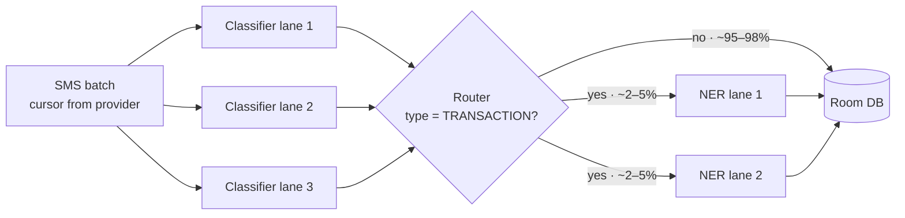
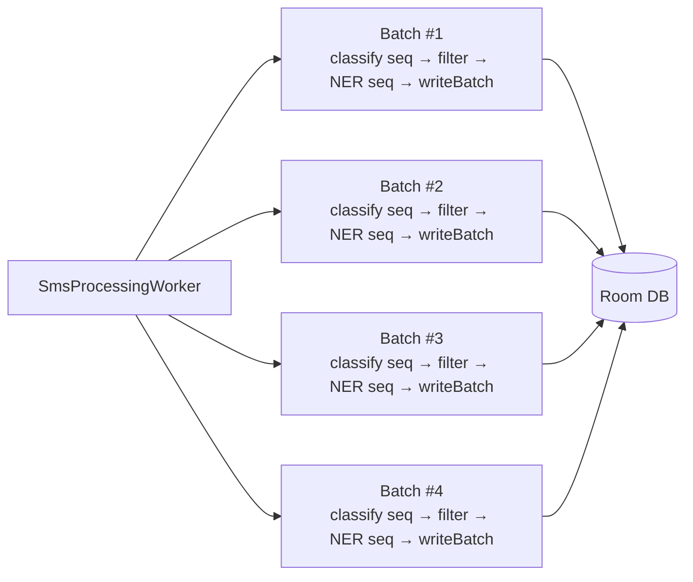

# Decision 3 · Inference concurrency

How do the classifier and NER cooperate at runtime — sequential, parallel,
or something in between?

## Three axes of "parallel"

"Parallel" is three independent questions. Getting them straight matters.

| Axis | Description | Verdict |
| --- | --- | --- |
| A · Both models on the SAME message | Kick off classifier and NER simultaneously; discard NER if not a transaction. | **Wrong axis** — runs NER on ~95% non-transactional messages. ~20× slower. |
| B · Same model, many messages in parallel | Multiple coroutines calling `ortSession.run()` on different messages. | **Already used** at the batch level in `processMultipleBatchesAfterId`. Safe because `OrtSession.run` is thread-safe. |
| C · Different stages, different messages, pipelined | Classifier feeds a filter which feeds NER. Message N+5 is being classified while message N is inside NER. | **The win.** NER fully overlaps classifier wall time. |

Every approach below is a specific combination of choices along axes B and
C. Axis A is always No.

## Router-gated dataflow

The design idea that makes everything else affordable: the classifier acts
as a cheap filter, so only the ~2–5% of transaction-tagged messages ever
touch NER.



The "lanes" are batch coroutines, not per-message workers. Concurrency
counts (3 classifier / 2 NER) are illustrative; tune with `cores / 2` as a
starting point.

## Approaches considered

### 3.1 · Serial batches (no parallelism)

Batches of N used only for I/O amortization; batches run **one after
another**, each doing classify → filter → NER → single Room `@Transaction`
write.

**Pros**

- Recovers the DB and cursor amortization wins (see "Why batches at all"
  below).
- Simple loop; no concurrency to reason about.
- Progress reporting is naturally batch-aligned.

**Cons**

- Multi-core CPUs are underutilized.
- Backfill wall time is roughly `N × batch_time` — 2–4× slower than 3.2.

**When it makes sense.** Very low-tier devices where parallel batches would
cause thermal throttling. Your `DeviceTierEvaluator` already selects this
implicitly for the smallest tier by setting `concurrency = 1`.

### 3.2 · Parallel batches, sequential stages within each batch (Option A)

The recommended shape. `SmsBatchProcessor` spawns 4 batch coroutines via
`processMultipleBatchesAfterId`. Each batch internally does:

```
classify 100 SMS sequentially
  → filter for TRANSACTION classification
  → run NER on the ~3 filtered SMS sequentially
  → one @Transaction write of SmsEntity + TransactionEntity
```

Four batches make progress at the same time.



At any moment: up to 4 classifier calls **or** up to 4 NER calls in flight,
because each batch is either in its classify stage or its NER stage.

**Pros**

- Uses all cores without oversubscribing (bounded to 4 concurrent
  inference calls total).
- No channel plumbing — plain list transforms inside each batch coroutine.
- DB writes stay batched (one `@Transaction` per batch).
- Straightforward extension of the existing `SmsBatchProcessor` shape.

**Cons**

- Within a batch, NER waits for the entire classifier pass to finish before
  starting. Leaves ~575 ms per batch of wall time on the table vs 3.3.
- NER concurrency is coupled to batch concurrency; can't be tuned
  separately.

**When it makes sense.** The default v1 shape. Ship this, measure, only
upgrade if the streaming savings matter.

### 3.3 · Parallel batches, streaming within each batch (Option B)

Same 4-batch outer parallelism, but inside each batch the two stages
**overlap**. As soon as the classifier tags a message as `TRANSACTION`,
it's pushed into a bounded `Channel` and picked up by an NER consumer
coroutine that runs concurrently with the classifier. Persistence is still
batched at the end.

```kotlin
suspend fun processBatch(rawBatch: List<SmsEntity>) = coroutineScope {
    val nerInputs = Channel<SmsEntity>(capacity = 8)
    val enrichedDeferred = async {
        buildList {
            for (sms in nerInputs) add(nerModel.extract(sms))
        }
    }

    val classified = rawBatch.map { sms ->
        val c = classifier.classifySms(sms.rawAddress, sms.body)
        val cs = sms.copy(/* … */)
        if (c.smsClassificationTypeId == TRANSACTION_TYPE_ID) nerInputs.send(cs)
        cs
    }

    nerInputs.close()
    val enriched = enrichedDeferred.await()

    smsDao.insertAllSmsMessages(classified)
    transactionDao.insertAllTransactions(enriched)
}
```

**Pros**

- ~20–35% batch wall-time savings in the average case because NER work
  overlaps the classifier's tail.
- Channel backpressure keeps memory bounded even if the classifier
  temporarily gets ahead of NER.

**Cons**

- Channel/coroutine plumbing is a real source of bugs (leaked coroutines,
  unclosed channels, dropped exceptions on cancellation).
- Savings collapse toward zero if all transactions cluster at the end of
  the batch.

**When it makes sense.** As a follow-up to 3.2 once you've measured that
the per-batch saving translates to a real user benefit.

### Anti-pattern for completeness — NER on every message

Kick off NER on every SMS in parallel with the classifier; discard NER
results for non-transaction messages. On a 1,000-SMS batch that's ~7 min
vs ~22 s for the router-gated approach. Do not do this.

## Wall-time comparison — 100-SMS batch, 3 transactions

| Approach | Classifier wall | NER wall | Total wall | vs baseline | Verdict |
| --- | ---: | ---: | ---: | ---: | --- |
| Baseline — classifier only (today) | 2000 ms | — | **2000 ms** | 1.00× | Reference |
| 3.1 Serial batches | 2000 ms | 1275 ms | **~3275 ms** × N batches | slow overall | Only tiny devices |
| **3.2 Option A — parallel batches, seq stages** | 2000 ms | 1275 ms (after) | **~3275 ms per batch** | 1.64× | **Ship first** |
| 3.3 Option B — parallel batches, streaming | 2000 ms | overlaps | **~2425 ms per batch** | 1.21× | Follow-up |
| Anti-pattern · NER on every message | 2000 ms | 42 500 ms | **~42.5 s** | 21.3× | Never |

Assumptions: classifier 20 ms/msg (working estimate — measure to confirm),
NER 425 ms/msg (from `docs/ner-v50-benchmark/README.md`). Wall-time savings
for streaming depend on how evenly transactions are distributed in the
batch.

## Zoom in — one batch coroutine over time (3.2 vs 3.3)

```
Time (ms):     0        500      1000     1500     2000     2500     3000    3275
               ├─────────┼────────┼────────┼────────┼────────┼────────┼───────┤

3.2 Option A   ████████████████████████████░░░░░░░░░░░░░░░░░░░░░░░░░░░▒
(batch         └────── classify 100 seq ──┘└─────── NER 3 seq ────────┘└DB┘
 handoff)              2000 ms                    1275 ms               ~50ms
                                                                        wall: 3275 ms

3.3 Option B   ████████████████████████████▒
(streaming)    └────── classify 100 seq ──┘└DB┘
                                            wall: ~2425 ms
                    ░░░░░       ░░░░░              ░░░░░
                    NER A       NER B              NER C
                    660-1085    1320-1745          2000-2425

  Legend:  █ classifier stage    ░ NER stage    ▒ batched DB write
```

Option B saves ~850 ms per batch (~26%) by starting NER on the first
transaction the moment it's classified. Savings collapse toward zero if
transactions cluster at the end of the batch.

## Why batches at all — the honest answer

Compared to "one-at-a-time strictly sequential", batching is doing three
real jobs. It is **not** for memory, resumability, or progress reporting;
those are cheap under any strategy.

| Job batching does | Batched (100 msgs / batch) | One-at-a-time | Effect on 50k backfill |
| --- | --- | --- | --- |
| Room / SQLite transactions | 500 fsyncs (~25 ms each) | 50k fsyncs (~20 ms each) | **~12 s vs ~17 min** |
| ContentProvider cursor opens | 500 opens (~2 ms each) | 50k opens (~2 ms each) | **~1 s vs ~100 s** |
| Coroutine-level parallelism | 4 batches in parallel | Impractical | **~4× throughput** |

The DB-transaction number is the biggest single win.
`insertAllSmsMessages(list)` is one SQL transaction with a single
`BEGIN…COMMIT` and one fsync. Per-message inserts are N separate
transactions with N fsyncs — a 50–100× cost difference on a full backfill.

## Concurrency and correctness gotchas

- **Shared `OrtEnvironment`, distinct sessions.** Both models call
  `OrtEnvironment.getEnvironment()`. Closing either session is safe; never
  close the env.
- **Per-session thread pools double-book cores.** Default `SessionOptions`
  gives each session its own ~4-thread intra-op pool. Two sessions × 4 =
  8 threads on a 4-core device. Set `setIntraOpNumThreads(2)` on each.
- **Accelerators serialize, they don't parallelize.** Two models on the
  same NNAPI / GPU delegate get serialized at the hardware queue. Start
  with CPU for both.
- **Wrap Sms + Transaction writes in one `@Transaction`.** Per-batch
  atomicity across the two tables survives a mid-write kill and defers FK
  checks to commit time. Multiple batches calling the `@Transaction`
  method concurrently is safe — SQLite serializes writers at the file-lock
  level.

```kotlin
@Dao
abstract class BatchWriteDao {
    @Insert
    abstract suspend fun insertSmsAll(sms: List<SmsEntity>): List<Long>

    @Insert
    abstract suspend fun insertTransactionsAll(txns: List<TransactionEntity>)

    @Transaction
    open suspend fun writeBatch(
        classified: List<SmsEntity>,
        buildTransactions: (List<Long>) -> List<TransactionEntity>,
    ) {
        val ids = insertSmsAll(classified)
        val txns = buildTransactions(ids)
        if (txns.isNotEmpty()) insertTransactionsAll(txns)
    }
}
```

## Recommendation

**Approach 3.2 — Parallel batches, sequential stages within each batch
(Option A).** Ship this first because:

- Smallest delta from the existing `SmsBatchProcessor` shape.
- The 4-way outer parallelism already provided by
  `processMultipleBatchesAfterId` becomes the concurrency budget for both
  stages automatically — no separate NER-concurrency knob to tune.
- Zero channel plumbing means fewer places for coroutine bugs.
- Per-batch wall time grows by ~1.64×, but since the 4 batches run in
  parallel, whole-worker wall time grows by only ~10–15% vs classifier-
  only baseline.

Upgrade to **approach 3.3 (streaming)** only after measuring real device
wall time and deciding the per-batch saving is worth the extra coroutine
complexity.
