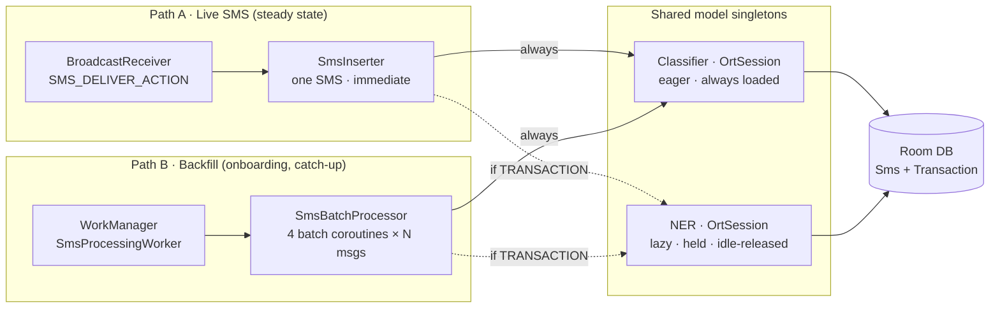

# NER Integration — Architectural Decisions

Companion to `NER_BACKGROUND_BENCHMARK.md`. This is the entry-point document
for integrating the banking NER model on top of the existing SMS classifier.
Three architectural decisions have to be locked before any integration code
is written. Each has its own deep-dive with alternatives, pros/cons, and a
recommendation.

- [1 · Deployment topology](ner-integration/01-topology.md) — one app or two?
- [2 · Model loading strategy](ner-integration/02-loading.md) — when does each `OrtSession` come alive?
- [3 · Inference concurrency](ner-integration/03-inference.md) — how do the two models cooperate at runtime?

## Anchoring numbers

Every trade-off in the deep-dive documents flows from these four measurements.
Numbers come from `ner-v50-bg500-v1` on a Samsung SM-S911B — see
`docs/ner-v50-benchmark/README.md`. MobileBERT v50 is the recommended NER
model.

| Metric | Value |
| --- | --- |
| NER p50 latency (MobileBERT v50) | **425 ms** |
| NER peak PSS | **294 MiB** |
| Classifier warm inference | ~20 ms (working estimate — measure to confirm) |
| SMS that are banking transactions | **~2–5%** |

The last row is what makes the whole design work: the classifier is cheap
and runs on every SMS; the NER is expensive and only runs on the small
transactional tail that the classifier routes to it.

## The two ingestion paths (context for every decision)

The app has two entry points that need inference, and they behave very
differently. This distinction shows up in every deep-dive below.

- **Path A** is stateless per message.
- **Path B** is a batched foreground worker used for the initial sync and
  catch-up.

Both paths call the same singleton model instances.

## Recommendations at a glance

| # | Decision | Recommended approach | Why |
| --- | --- | --- | --- |
| 1 | Topology | **Single app, modularized** | Ships fast, avoids the default-SMS-handler + Play policy pitfalls of a two-app split, keeps future DFM / flavor migration cheap. |
| 2 | Loading | **Classifier eager, NER lazy + held** | Zero-cost classifier warmth for the guaranteed-common path; one-off NER load per usage window; memory freed on idle and pressure. |
| 3 | Concurrency | **Router-gated batch pipeline (Option A)** | Smallest delta from existing pipeline; the 4-way batch parallelism already gives ~4× throughput; streaming can be a follow-up. |

## Net effect on the existing pipeline

- `SmsBatchProcessor.classifySmsBatch()` stays as-is.
- A new stage runs downstream: filter for `TRANSACTION` classification, hand
  the subset to `NerModel.extract()`, write both `SmsEntity` and a new
  `TransactionEntity` table in one `@Transaction`.
- Backfill wall time grows by roughly **10–15%**.
- Ongoing per-SMS latency in Path A is unchanged for the ~95% of
  non-transaction messages; only actual bank SMS pay the NER cost.

## What comes next

With the three decisions locked, the remaining design work is concrete and
well-scoped:

- `NerModel` singleton (lazy load, `Mutex`, idle release, `onTrimMemory`
  hook).
- `TransactionEntity` Room schema + `BatchWriteDao` with `@Transaction`
  wrapping.
- Modification to `SmsBatchProcessor.processSmsInBatches` for the
  router-gated NER stage.
- Retention-policy plumbing in `SmsProcessingService` +
  `Application.onTrimMemory`.
- Room migration for the new table.
- New `:feature-expenses` module and Gradle wiring.
